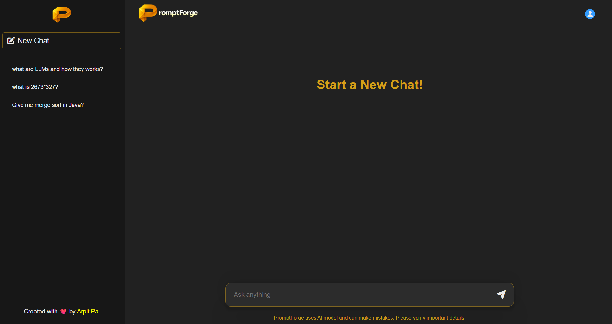
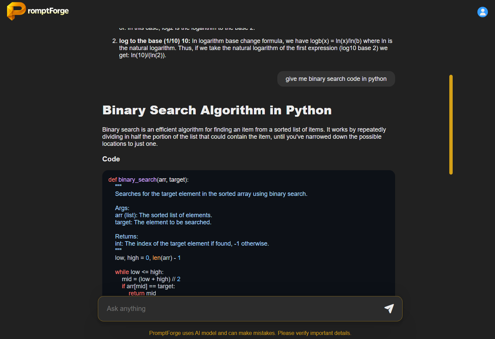
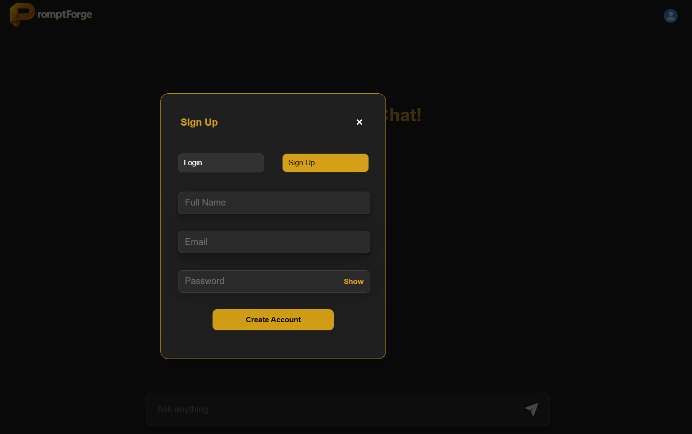

# PromptForge : Smart AI Assistant


-purple)

PromptForge is a MERN-based full‑stack AI chat application that exposes an authenticated chat interface backed by a Groq LLM. Users can create named chat threads, send prompts to the server, and receive AI-generated responses that are stored for later replay. The UI emphasizes quick iteration: new threads, threaded history in a sidebar, Markdown‑rendered replies with syntax highlighting, and a lightweight typing animation to improve perceived responsiveness.

The app stores conversation history in MongoDB and uses session + cookie authentication with Passport (local strategy).

The backend centralizes responsibilities: user management, session cookies, thread persistence and proxying calls to the Groq API (the app uses `llama-3.1-8b-instant` for completions). All AI calls are executed server-side so the API key remains secret and usage can be logged or limited.


## Live Deployed App Link

- **Live App:** https://promptforge-smart-ai-assistant.vercel.app


## Overview

- Authentication
  - Email/password signup and login using `passport-local` and `passport-local-mongoose`.
  - Sessions stored in MongoDB via `connect-mongo`; cookies configured with `httpOnly` and production `secure` flags.

- Conversations
  - Each `Thread` document contains a `threadId`, `title`, `userId`, and `messages[]`.
  - Messages store `role` (`user` or `assistant`), `content`, and `timestamp`.

- AI Integration
  - Backend helper `backend/utils/openai.js` forwards prompt text to Groq's chat completions endpoint:

    - Endpoint: `https://api.groq.com/openai/v1/chat/completions`
    - Model used: `llama-3.1-8b-instant` (Groq)

  - The server extracts `data.choices[0].message.content` and persists the assistant's reply alongside the user's prompt.

- Frontend
  - Single page React app (Vite). Sidebar for history, central chat window, and an auth modal.
  - Markdown rendering via `react-markdown` and `rehype-highlight` to display code and formatted replies.
  - Typing animation implemented by revealing assistant reply word-by-word.

- Backend
  - Express server with session support (express‑session + connect‑mongo). Authentication via `passport-local` and `passport-local-mongoose`.


## Live Application Screenshots

Home / Sidebar view:


Chat window with message & typing effect:


Auth modal (login/signup):



## Key Features

- Email/password sign up and login (Passport + passport-local-mongoose).
- Session-based auth with cookie support and MongoDB-backed session store.
- Create / switch / delete chat threads for the logged-in user.
- Post prompts to the backend; responses are fetched from the Groq API and saved in the thread messages.
- Frontend displays messages with Markdown rendering and syntax highlighting (`react-markdown` + `rehype-highlight`).
- Typing animation for assistant replies and a loader while waiting for responses.


## Tech Stack

- Frontend: React, Vite, react-markdown, rehype-highlight, react-spinners
- Backend: Node.js, Express, mongoose, passport, passport-local-mongoose, express-session, connect-mongo
- Database: MongoDB (Atlas)
- AI: Groq chat completions (llama-3.1-8b-instant)
- Deployment: Vercel (frontend), Render (backend)

## Project Structure

- `backend/`
  - `server.js` — Express app, CORS, session, Passport, MongoDB connection
  - `package.json` — backend dependencies
  - `models/user.js` — `User` Mongoose model (passport-local-mongoose plugin)
  - `models/thread.js` — `Thread` model with embedded `messages` schema
  - `routes/auth.js` — `/api/auth` signup/login/logout/status routes
  - `routes/chat.js` — `/api/thread`, `/api/thread/:threadId`, `/api/chat`
  - `utils/openai.js` — helper that calls Groq chat completions

- `frontend/`
  - `index.html`, `vite.config.js`
  - `package.json` — frontend deps + scripts
  - `src/App.jsx` — main app and context provider
  - `src/MyContext.jsx` — React context
  - `src/Sidebar.jsx` — thread list, create/delete/switch thread
  - `src/ChatWindow.jsx` — main chat UI, auth dropdown, input
  - `src/Chat.jsx` — message rendering (Markdown + highlight + typing effect)
  - `src/AuthModal.jsx` — login/signup modal
  - `public/` — static images


## Environment & Setup

Prerequisites: Node.js (18+ recommended), a MongoDB Atlas cluster, a Groq API key.

1. Backend

```bash
cd backend
npm install
```

Create a `.env` in `backend/` with at least:

```env
ATLASDB_URL=your_mongodb_atlas_connection_string
SECRET=a_random_session_secret
GROQ_API_KEY=your_groq_api_key
FRONTEND_URL=http://localhost:5173
PORT=8080    # optional
NODE_ENV=development
```

Run the backend:

```bash
node server.js
# or with nodemon (if installed):
nodemon server.js
```

2. Frontend

```bash
cd frontend
npm install
npm run dev
```

Open the app at `http://localhost:5173` (frontend) while backend runs (default `http://localhost:8080`).

Important: frontend fetches backend endpoints with `credentials: 'include'` to send cookies; ensure CORS origins and `FRONTEND_URL` in `.env` match your frontend host.

## API Endpoints

- `POST /api/auth/signup` — register (body: `{ name, email, password }`)
- `POST /api/auth/login` — login (body: `{ email, password }`)
- `POST /api/auth/logout` — logout (clears session)
- `GET /api/auth/status` — returns `{ authenticated: true/false, user? }`
- `GET /api/thread` — list user threads (requires session cookie)
- `GET /api/thread/:threadId` — get messages for a thread
- `DELETE /api/thread/:threadId` — delete a thread
- `POST /api/chat` — send prompt (body: `{ threadId, message }`) → returns assistant reply and saves messages

All authenticated routes require the session cookie (set by the backend on login).


## Why This Project

- Demonstrates secure server-side LLM integration pattern (proxying LLM calls through a controlled backend).
- Shows a real-world session + cookie authentication flow with persistent chat history.
- Practical UX for building LLM-powered assistants: typing feedback, Markdown output, and thread management.
- Useful as a portfolio piece combining full-stack development, authentication, persistence and AI integration.

## Deployment (what I used)

- Backend (Render)
  - The backend runs as a Node/Express service on Render. Key steps used during deployment:
    1. Create a new Web Service on Render and connect the Git repository.
    2. Set environment variables on Render: `ATLASDB_URL`, `SECRET`, `GROQ_API_KEY`, `FRONTEND_URL` (production frontend URL).
    3. Use the build/start command `node server.js` (or `npm start`).
    4. Ensure CORS `FRONTEND_URL` is set so the deployed frontend can access the API.

- Frontend (Vercel)
  - Frontend is deployed as a static React app on Vercel:
    1. Connect the repo to Vercel and point the project to the `frontend/` directory.
    2. Vercel builds and serves the site; it communicates with the Render backend using the configured URL.


## Notes & Implementation Details

- Sessions are persisted using `connect-mongo` to MongoDB; cookies are configured in `server.js` with `httpOnly`, `secure` in production, and `sameSite` adjusted for production mode.
- Authentication uses `passport-local-mongoose` which handles password hashing and helper methods (`register`, `authenticate`, `serializeUser`, `deserializeUser`).
- The backend uses a small helper `backend/utils/openai.js` to call the Groq chat completions endpoint and returns `data.choices[0].message.content` as the assistant reply.
- Frontend displays assistant content as Markdown and applies a word-by-word typing animation for new replies.

## Known Limitations

- No rate limiting or input sanitization for prompts, so be cautious when deploying publicly.
- Groq API calls are proxied server-side; the app depends on the availability and quota of the Groq API key.
- User management is basic (local email/password); no email verification or password reset flow implemented.

## Future Improvements

- Add proper input validation and rate limiting on the backend.
- Add pagination / limit parameters for thread and message queries.
- Add email verification and password-reset flows.
- Add user profile and avatar upload.


